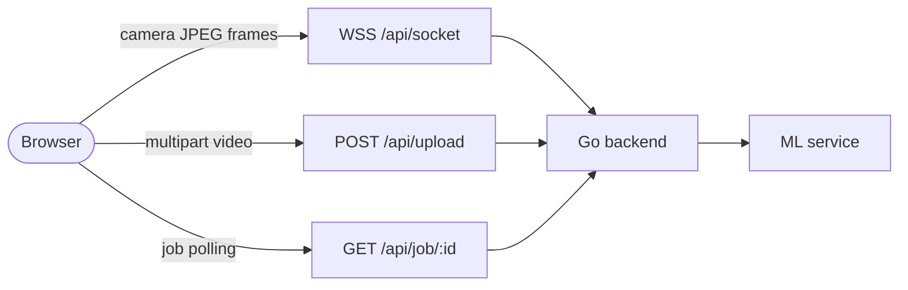

# Sigma Sign — Frontend

Browser UI for experimental isolated-gesture recognition in Russian Sign Language (RSL). It captures webcam frames or uploads a video, talks to the Sigma Sign Go backend, and presents the resulting transcript.

🇷🇺 [Русская версия](README.ru.md)

**[Live demo](https://hack.eferzo.xyz/)** · **[Swagger UI](https://hack.eferzo.xyz/swagger/index.html)** · **[Organization overview](https://github.com/HSE-SignLanguage/.github)**

> Sigma Sign is a beta research prototype. It is not a continuous RSL translator and is not a replacement for a human interpreter.

## Modes

- **Camera (`/`)** — captures compressed JPEG frames, sends them through one WebSocket, and prefers the backend's authoritative `full_text` transcript snapshots.
- **Video file (`/`)** — accepts a video up to 100 MiB, starts an asynchronous backend job, polls its bounded status endpoint, and displays the completed transcript.
- **Simplified UI (`/simple/`)** — the same live pipeline with larger controls, linear navigation, explicit status copy, and a light high-contrast layout.

The modern UI is responsive and keeps the existing Sigma Sign palette. Both views support keyboard focus, screen-reader status announcements, reduced motion, and touch targets sized for mobile use.

## Stack and request flow

- Vue 3 + Vue Router
- Vite 8
- Vitest
- Unprivileged Nginx runtime container



Related services: [`backend`](https://github.com/HSE-SignLanguage/backend) · [`ml`](https://github.com/HSE-SignLanguage/ml)

## Browser/backend URL contract

`VITE_API_BASE_URL` is normalized to a trailing slash. If it is empty or invalid, the frontend safely falls back to same-origin `/api/`.

| Operation | Default public URL | Backend path after `/api` is stripped |
| --- | --- | --- |
| Live frames | `wss://<host>/api/socket` | `/socket` |
| Upload video | `POST https://<host>/api/upload` | `/upload` |
| Poll job | `GET https://<host>/api/job/{id}` | `/job/{id}` |

WebSocket responses use this compatible shape:

```json
{
  "type": "transcript",
  "text": "new append-only segment",
  "full_text": "authoritative transcript snapshot",
  "confidence": 0.91
}
```

New clients prefer `full_text`; `text` remains a delta fallback. See the [backend API documentation](https://github.com/HSE-SignLanguage/backend#api) for upload and job response schemas.

## Local development

Node.js 22.12 or newer is recommended.

```bash
cp .env.example .env
npm ci
npm run dev
```

The development server runs at `http://localhost:5173`. The provided environment example points directly to a backend at `http://localhost:8080`:

```env
VITE_API_BASE_URL=http://localhost:8080
FRONTEND_PORT=8081
```

`VITE_API_BASE_URL` is a Vite build-time value. Rebuild the frontend after changing it. For production behind one reverse proxy, leave it empty and use the `/api/` fallback to avoid mixed-content and cross-origin problems.

Available scripts:

```bash
npm test          # unit tests for URL handling, polling and realtime lifecycle
npm run build     # production bundle in dist/
npm run preview   # serve the production bundle locally
```

## Docker

```bash
docker compose up --build
```

The container listens on port `8081`, runs Nginx as UID `101`, and exposes `GET /healthz`. The runtime serves SPA routes, returns `index.html` with `no-store`, caches hashed assets as immutable, and adds basic browser security headers.

To bake an explicit API base into the bundle:

```bash
docker build --build-arg VITE_API_BASE_URL=https://api.example.test/ -t sigma-sign-frontend .
```

## Dokploy path routing

The production deployment uses one HTTPS origin. A minimal Dokploy setup is:

| Service | Host path | Container port | Strip path |
| --- | --- | ---: | --- |
| Frontend | `/` | `8081` | No |
| Backend | `/api` | `8080` | Yes |
| Backend Swagger (optional) | `/swagger` | `8080` | No |

The `/api` route must support WebSocket upgrades. The browser connects to `/api/socket`, while the backend receives `/socket`. Do not set a backend or ML container's `localhost` address as `VITE_API_BASE_URL`; this value is used by the user's browser, not by Docker networking.

## Reliability and accessibility

- Camera permission and WebSocket handshakes have bounded timeouts; a user can cancel while connecting.
- Session generations prevent late camera/WebSocket callbacks from reviving a stopped session.
- Hidden, offline, unmounted, or page-hidden views release the camera and socket.
- Only one frame encode is active; frames are skipped when WebSocket buffering exceeds 64 KiB.
- Upload and polling requests are abortable. Polling has request/total timeouts, exponential backoff, terminal client errors, and `Retry-After` handling for `429`.
- Transcripts are capped client-side to avoid unbounded DOM memory growth.
- Status regions use `aria-live`; the upload surface is keyboard-operable; focus is visible; layouts have no horizontal overflow at 375 px.

## Known limitations

- Camera capture requires HTTPS or localhost and explicit browser permission.
- Resetting the upload UI stops waiting locally but cannot cancel a job already accepted by the backend; there is no job-cancel endpoint yet.
- Upload progress is state-based rather than precise byte-level network progress.
- Transcript and job state live in memory and are not restored after a page reload.
- Browser/device behavior still needs real-device coverage in addition to automated viewport checks.
- Recognition quality and vocabulary are properties of the [ML service](https://github.com/HSE-SignLanguage/ml#known-limitations); frontend presentation cannot recover an incorrectly recognized gesture.
