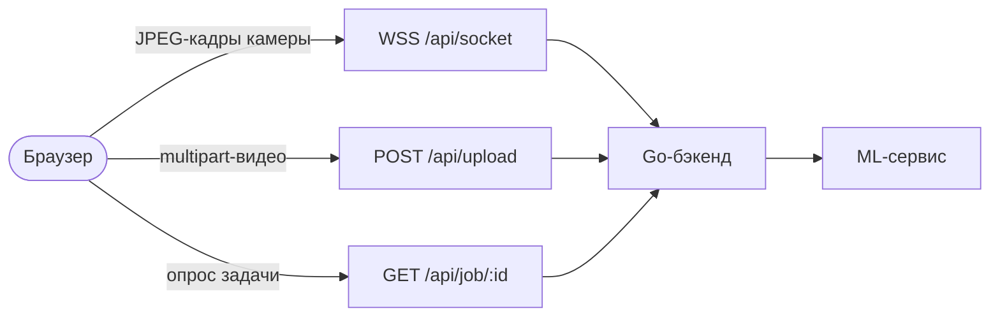

# Sigma Sign — фронтенд

Браузерный интерфейс экспериментального распознавания изолированных жестов русского жестового языка (РЖЯ). Он захватывает кадры с камеры или принимает видеофайл, обращается к Go-бэкенду Sigma Sign и показывает итоговый текст.

🇬🇧 [English version](README.md)

**[Демо](https://hack.eferzo.xyz/)** · **[Swagger UI](https://hack.eferzo.xyz/swagger/index.html)** · **[Обзор организации](https://github.com/HSE-SignLanguage/.github)**

> Sigma Sign — исследовательский beta-прототип. Это не непрерывный переводчик РЖЯ и не замена человеку-переводчику.

## Режимы

- **Камера (`/`)** — сжимает кадры в JPEG, отправляет их через один WebSocket, сразу показывает каждый принятый жест, а затем заменяет черновой хвост оформленной фразой от бэкенда.
- **Видеофайл (`/`)** — принимает видео до 100 МиБ, запускает асинхронную задачу на бэкенде, опрашивает её ограниченный status endpoint и показывает готовую расшифровку.
- **Упрощённый интерфейс (`/simple/`)** — тот же live-пайплайн с крупными элементами, линейной навигацией, явными статусами и светлым контрастным оформлением.

Современный интерфейс адаптивен и сохраняет палитру Sigma Sign. Обе версии поддерживают клавиатурный фокус, объявления статусов для screen reader, reduced motion и удобные touch targets.

## Стек и поток запросов

- Vue 3 + Vue Router
- Vite 8
- Vitest
- Nginx в непривилегированном runtime-контейнере



Связанные сервисы: [`backend`](https://github.com/HSE-SignLanguage/backend) · [`ml`](https://github.com/HSE-SignLanguage/ml)

## Контракт URL между браузером и бэкендом

`VITE_API_BASE_URL` нормализуется с завершающим `/`. Если значение пустое или невалидное, фронтенд безопасно использует same-origin `/api/`.

| Операция | Публичный URL по умолчанию | Путь на бэкенде после удаления `/api` |
| --- | --- | --- |
| Live-кадры | `wss://<host>/api/socket` | `/socket` |
| Загрузка видео | `POST https://<host>/api/upload` | `/upload` |
| Опрос задачи | `GET https://<host>/api/job/{id}` | `/job/{id}` |

Текущий WebSocket-контракт разделяет мгновенное распознавание и оформление фразы:

```json
{
  "type": "gesture",
  "text": "я",
  "full_text": "я",
  "literal_text": "я",
  "final_text": "",
  "draft_text": "я",
  "confidence": 0.91,
  "sequence": 1,
  "segment_id": 1,
  "status": "draft",
  "truncated": false
}
```

| Событие | Назначение |
| --- | --- |
| `gesture` | Сразу добавляет один сырой результат модели в ограниченную ленту жестов и обновляет черновик. |
| `formatting` | Отмечает сегмент как оформляемый и передаёт снимки текста, но не запускает видимую перезапись. |
| `transcript` | Фиксирует дословный или оформленный ИИ сегмент; только это событие запускает мягкую анимацию замены фразы. |

`full_text` — всегда авторитетное значение для отображения; именно оно попадает в TXT. `literal_text` независимо сохраняет только свидетельства распознавателя даже после ИИ-оформления. `final_text` и `draft_text` позволяют различать закреплённый текст и дословный хвост жестов. `sequence` убирает дубли, а `segment_id` связывает статус оформления с фразой. Когда `truncated` становится `true`, ограниченная сессия уже удалила самый старый завершённый префикс, и интерфейс показывает об этом примечание.

Старые сообщения бэкенда остаются совместимы:

```json
{
  "type": "transcript",
  "text": "новый append-only фрагмент",
  "full_text": "авторитетный снимок расшифровки",
  "confidence": 0.91
}
```

Клиент предпочитает `full_text`; `text` остаётся fallback-дельтой. Схемы upload/job описаны в [документации бэкенда](https://github.com/HSE-SignLanguage/backend/blob/main/README.ru.md#api).

## UX live-распознавания

Панель камеры честно разделена на два слоя:

- **Эфир жестов** — до десяти последних сырых результатов модели в виде чипов с confidence, если он доступен. Они не выдаются за грамматически готовый текст.
- **Связный текст** — закреплённая часть и сырой черновик визуально различаются. Компактный статус показывает работу ИИ, а фраза меняется только после события `transcript`.

Для изолированного распознавания показывайте жесты по одному в отмеченной области камеры. Между одинаковыми жестами нужна короткая нейтральная пауза, чтобы распознаватель мог их разделить. Интерфейс не обещает непрерывный перевод РЖЯ.

## Локальная разработка

Рекомендуется Node.js 22.12 или новее.

```bash
cp .env.example .env
npm ci
npm run dev
```

Dev-сервер запускается на `http://localhost:5173`. Готовый пример окружения обращается напрямую к бэкенду на `http://localhost:8080`:

```env
VITE_API_BASE_URL=http://localhost:8080
FRONTEND_PORT=8081
```

`VITE_API_BASE_URL` — build-time значение Vite. После его изменения фронтенд нужно пересобрать. В production за единым reverse proxy лучше оставить его пустым и использовать fallback `/api/`, чтобы избежать mixed-content и cross-origin проблем.

Команды:

```bash
npm test          # unit-тесты URL, polling и realtime lifecycle
npm run build     # production bundle в dist/
npm run preview   # локальная раздача production bundle
```

## Docker

```bash
docker compose up --build
```

Контейнер слушает порт `8081`, запускает Nginx под UID `101` и предоставляет `GET /healthz`. Runtime поддерживает SPA-маршруты, отдаёт `index.html` с `no-store`, кеширует хешированные assets как immutable и добавляет базовые security headers браузера.

Чтобы встроить явный API base в bundle:

```bash
docker build --build-arg VITE_API_BASE_URL=https://api.example.test/ -t sigma-sign-frontend .
```

## Маршрутизация в Dokploy

Production использует один HTTPS origin. Минимальная конфигурация Dokploy:

| Сервис | Путь хоста | Порт контейнера | Strip path |
| --- | --- | ---: | --- |
| Фронтенд | `/` | `8081` | Нет |
| Бэкенд | `/api` | `8080` | Да |
| Swagger бэкенда (необязательно) | `/swagger` | `8080` | Нет |

Маршрут `/api` должен поддерживать WebSocket upgrade. Браузер подключается к `/api/socket`, а бэкенд получает `/socket`. Нельзя указывать в `VITE_API_BASE_URL` адрес `localhost` контейнера бэкенда или ML: это значение использует браузер пользователя, а не Docker network.

## Надёжность и доступность

- Запрос разрешения камеры и WebSocket handshake ограничены таймаутами; подключение можно отменить.
- Поколения сессий не позволяют поздним callback камеры/WebSocket оживить остановленную сессию.
- При hidden/offline/unmount/pagehide камера и сокет освобождаются.
- Одновременно выполняется только одно кодирование кадра; при WebSocket buffer больше 64 КиБ кадры пропускаются.
- Upload и polling можно прервать локально. У polling есть request/total timeout, exponential backoff, terminal client errors и поддержка `Retry-After` для `429`.
- Длина расшифровки ограничена на клиенте, чтобы память DOM не росла бесконечно.
- Сырая лента дедуплицируется по `sequence` и ограничена десятью жестами; новая сессия камеры полностью очищает live-состояние.
- Только распознанный `literal_text` и монотонный маркер `truncated` хранятся отдельно от оформленной фразы.
- Статусы используют `aria-live`, upload-зона доступна с клавиатуры, фокус видим, а на ширине 375 px нет горизонтального переполнения.
- Появление чипа и замена фразы используют одну 240-мс motion-систему только через `transform` и `opacity`; при `prefers-reduced-motion` она отключается.

## Известные ограничения

- Камера работает только в HTTPS-контексте или на localhost и требует явного разрешения браузера.
- Сброс upload-интерфейса прекращает локальное ожидание, но не отменяет уже принятую бэкендом задачу: cancel endpoint пока нет.
- Прогресс загрузки отражает состояние, а не точное число переданных по сети байтов.
- Расшифровка и состояние задачи хранятся в памяти и не восстанавливаются после reload страницы.
- Помимо автоматических viewport-проверок всё ещё нужны тесты на реальных браузерах и устройствах.
- Качество и словарь распознавания определяются [ML-сервисом](https://github.com/HSE-SignLanguage/ml/blob/main/README.ru.md#известные-ограничения); фронтенд не может исправить неверно распознанный жест.
